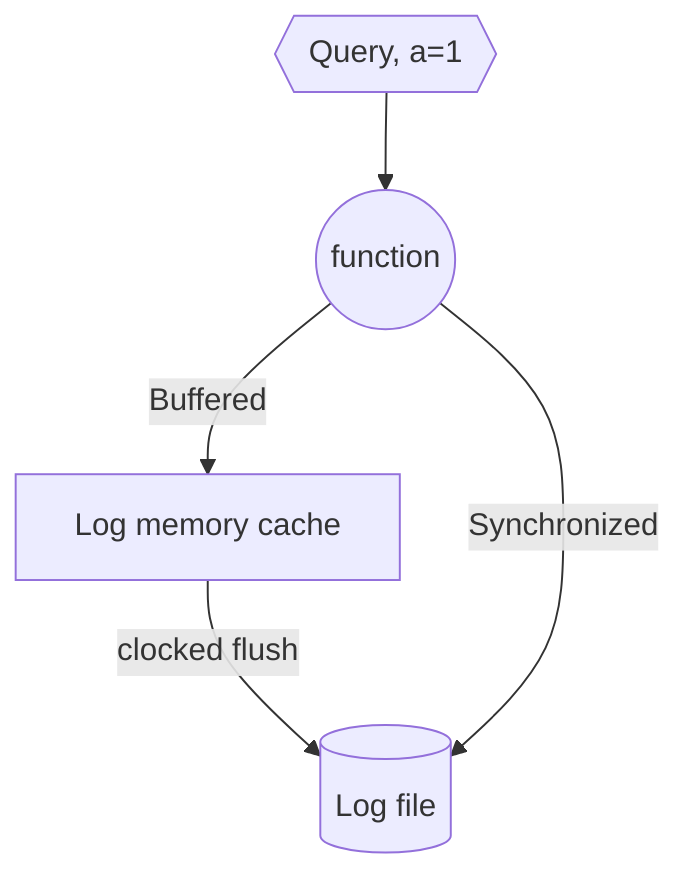

# Experiment design

1. Requirements and goals
1. Data structure and API's
1. Design
1. Discussion

## Requirements and Goals

### Goals of the logger

1. A logical clock based log.
1. Allows writing data entities to disk.
1. Includes write modes,
   - Fast, in memory. May lose data.
   - Slow, direct to disk. Data is persistent.

### Functional Requirements

1. Keeps a recoverable copy of the logical clock on disk.
1. Can seek fast.
1. Has read cursors
   - Cursors can store current location to disk.
   - Cursor can seek, as fast as possible. (Index?)
1. Can replay from any point in the cursor, in the case of recovery.
1. Logrotate can be executed.
1. Includes persistence modes,
   - In memory: entry is stored to memory and lazily to disk
     - periodic flush
     - buffer flush
   - Disk sync: entry is given a disk persistence and call will not complete until disk writing is done.

### Non Functional requirements

1. The data should be stored in a log file that can be rotated. From logrotate use the mode `copytruncate`- Truncate the original log file in place after creating a copy, instead of moving the old log file and optionally creating a new one.
1. Signal machine.
1. Persistent multi location storage? (Optional)

## Data structures and API's

Entry,

- lc: logical clock entry - also serves as clock id
- ts: timestamp
- level: ERROR|WARNING|INFO|DEBUG|TRACE
- hash: data hash
- data: binary

Cursor,

- lc: location of the logical clock
- path: None or path to the where the last read logical clock entry is.

### WEB API's

For the web api, this is an optional thing. So I think we should not add it. We can in general create the package and allow api calls to be made via an vertically mounted service in code.

### APP API's

1. append (entry) - add a new command to the log
   - add common `error,info,debug` .. etc
   - returns Entry object, that can be ack
1. find(ts|ls) - find an entry -> returns the entry
1. cursor(ts|ls|entry) - create a new cursor from the ts|ls|entry

## High level design

Our logger is a local commit logger, e.g. The main objective is to record commands coming to a function, and be able to replay them in the case where it is needed (crash, error, retry ext.)

### Usage example

1. We have a function (for example webserver route, read and execute, et... )
1. This function accepts parameters for execution.
1. Every time the function executes, we want to store the execution in a log.
1. If the function finishes execution, we want to write a log entry for this execution.

The way that we write the log entry, for the execution, is dependent upon the mode of use,

1. Buffer - we write everything in memory - and only then flush to disk.
1. Synchronized - we write directly to disk.

### Do we need an "ack" mechanism?

If we are without the ack, we would have to perform the action and only then log, e.g. the log is done in the end of the execution. Is this ok?

Lets take the case of a key value store; if we store everything in memory and only write to disk periodically, if the server crashes, we would need to load everything that was not flashed to disk. E.g.

Logger in Synchronized mode, that is every entry flushes a log.

1. Receive a=1, log flush
1. Receive b=1, log flush
1. Flush
1. Receive a=2, log flush
   --- server crash & recover
1. Reload

| command | log                      | data in mem     | data on disk    |
| ------- | ------------------------ | --------------- | --------------- |
| a=1     | a=1                      | a=1             | -               |
| b=1     | a=1  b=1              | a=1  b=1     | -               |
| flush   | a=1  b=1              | a=1  b=1     | a=1  b=1     |
| a=2     | a=1  b=1   a=2     | a=2  b=1     | a=1  b=1     |
| recover | a=1  b=1   **a=2** | **a=1**  b=1 | **a=1**  b=1 |

A=2 was completed but not flushed - loss of data on a. Its log is on disk though.

So in this case our log dose not match the database and we would need to replay the un-unflushed log entries. But there is no way for us to know which log entries were flushed already.

One way to solve this is to write down the flush point. e.g. -> every time we flush we write down a log entry of the last flush point. We then search back for the last flush point on recover, and set our cursor to that. If we do this in a synchronized manner we have the ability to reload the log entries according to the last flash point.

This though would require us to read the log slowly backwards to recover. This would not be that bad and can be optimized in the future.

### What modes should we support
There are three outcomes for a function,
1. Aborted.
1. Errored.
1. And complete. 

In general we want to write the log entry according to the response mechanism of the function and would want all three options.

### Diagram

### Loss of the log cache

What happens if the function completes, and the log entry is lost (cache is lost) - in this case the data in the log is lost. 

Which means that if a log entry requires persistance (say it was added to a database and completed) then we need to flush the log to disk.

We therefore understand that if the log entry requires persistance then we need to sync in software.

This is of course not the best.