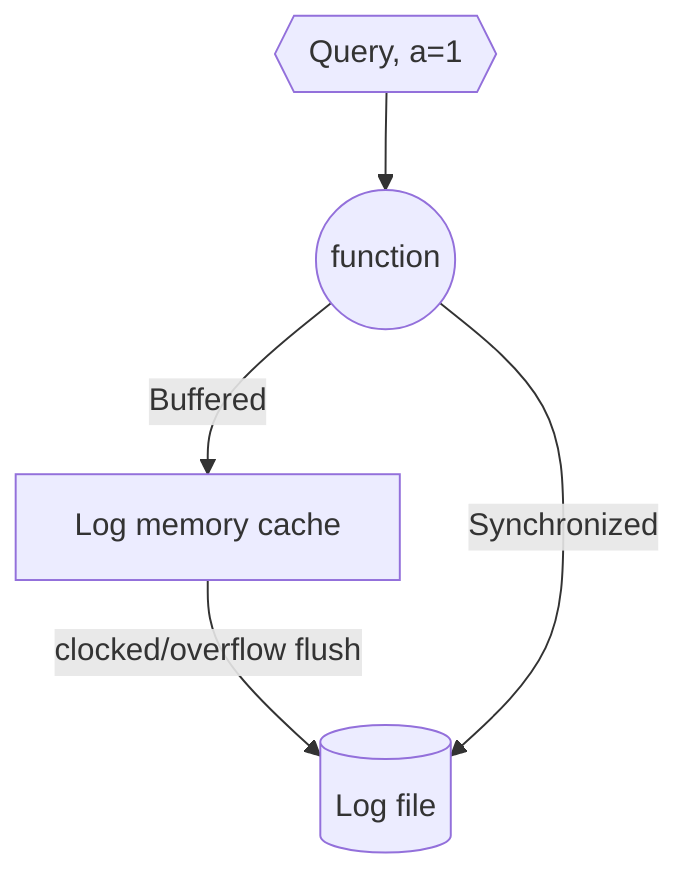
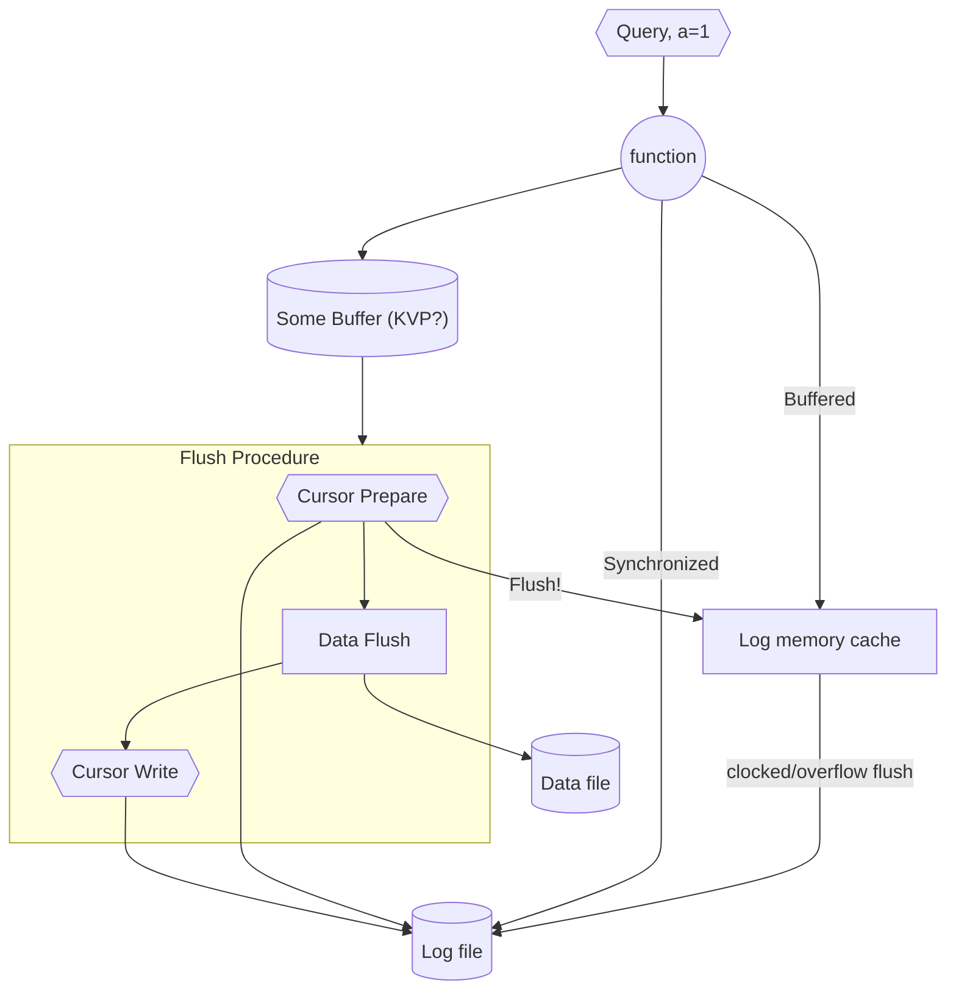

# Experiment design

1. Requirements and goals
1. Data structure and API's
1. Design
1. Discussion

## Requirements and Goals

### Goals of the logger

1. A logical clock based log.
1. Allows writing data entities to disk.
1. Includes write modes,
   - Fast, in memory. May lose data.
   - Slow, direct to disk. Data is persistent.
1. Allows replay of data entities in the case of failure.

### Functional Requirements

1. Keeps a recoverable copy of the logical clock on disk. What was the last entry.
1. Has read cursors, Cursors hold the current state of a "cursor group" (e.g. "kvps", "locks")
1. Can recover the last point of any cursor commit. e.g. The logical clock location where the the last action set completion was committed (data dump to disk of all records, lock enable and disable ..)
1. Logrotate can be executed on the log file.
1. Includes persistence modes,
   - Buffered, log entries are first stored to memory and then flushed.
   - Synched, all log entries immediately are flushed to disk.

#### Future functional requirements

1. Can seek fast.
1. Cursor can seek, as fast as possible. (Index?)

### Non Functional requirements

1. The data should be stored in a log file that can be rotated. From logrotate use the mode `copytruncate`- Truncate the original log file in place after creating a copy, instead of moving the old log file and optionally creating a new one.
1. Solitary machine log.

#### Future non functional requirements

1. Persistent multi location storage? (Optional), e.g. Allows any log file to be stored multiple times, for persistance.

## Data structures and API's

Entry,

- lc: logical clock entry - also serves as clock id
- ts: timestamp
- level: ERROR|WARNING|INFO|DEBUG|TRACE
- hash: data hash
- data: binary

Cursor,

- lc: location of the logical clock

### APP API's

1. commit (entry) - add a new command to the log
   - add common `error,info,debug` .. etc
   - returns Entry object, that can be ack
1. cursor(name) - create a readable cursor object.

#### Future app apis

1. find(ts|ls) - find an entry -> returns the entry

## High level design

Our logger is a local commit logger, e.g. The main objective is to record commands coming to a function, and be able to replay them in the case where it is needed (crash, error, retry ext.)

### Usage example

1. We have a function (for example web-server route, read and execute, et... )
1. This function accepts parameters for execution.
1. Every time the function executes, we want to store the execution in a log.
1. If the function finishes execution, we want to write a log entry for this execution.

The way that we write the log entry, for the execution, is dependent upon the mode of use,

1. Buffer - we write everything in memory - and only then flush to disk.
1. Synchronized - we write directly to disk.

### Do we need an "ack" mechanism?

With no "log action complete" acknowledge mechanism, we would have to perform the action and only then log, e.g. the log is done at the end of the execution. Is this ok?

Lets take the case of a key value store; if we store everything in memory and only write to disk periodically, if the server crashes, we would need to load everything that was not flashed to disk. E.g.

(Logger in Synchronized mode -> every set flushes a log entry)

1. Receive a=1, log flush
1. Receive b=1, log flush
1. Flush data to disk
1. Receive a=2, log flush
   --- server crash & recover
1. Reload ...

| command | log                      | data in mem     | data on disk    |
| ------- | ------------------------ | --------------- | --------------- |
| a=1     | a=1                      | a=1             | -               |
| b=1     | a=1  b=1              | a=1  b=1     | -               |
| flush   | a=1  b=1              | a=1  b=1     | a=1  b=1     |
| a=2     | a=1  b=1   a=2     | a=2  b=1     | a=1  b=1     |
| recover | a=1  b=1   **a=2** | **a=1**  b=1 | **a=1**  b=1 |

`a=2` was flushed to log but not written to disk -> loss of data on a. We need a way to recover this.

So in this case our log dose not match the data on disk and we would need to replay the un-flushed log entries. But there is no way for us to know which log entries were flushed already.

One way to solve this is to write down the data flush point. e.g. -> every time we flush kvp data to disk we write down a log entry of the last flushed log line logical clock. On failure, we then search back for the last log line flush point logical clock, and then replay any action that came after that.

Note that this would require us to read back the log, which may be slow in the case where we have large data structures that we save. This can be mitigated via an index. (Optimizations for later)

### What log line write modes should we support (decorators)

There are three outcomes for a function,

1. Aborted.
1. Errored.
1. And complete.

In general we want to write the log entry according to the response mechanism of the function and would want all three options.

We may also want to log the function response, as a log line.

### Basic logging diagram

(Full diagram below)

### Failure point: Loss of the log cache

What happens if the function completes, and the log entry is lost (cache is lost) - in this case the data in the log is lost.

This can present an issue, if the log was not flushed but the data was flushed to disk. E.g. the data was flushed before the log was.

In this case, we would need to make sure the every time the data is flushed to disk, the log is flushed first, then after the data is flushed, the log cursor is flushed as well.

Note that, if the data is flushed and the log cursor is not flushed then we would have an error. We therefore would flush twice on the log.

1. Before the data is flushed (prepare)
1. After the data is flushed with the new logical clock entry. (cursor flush)

We would know there is data corruption in the case we see a data prepare flush but no log cursor flush.

#### Failure point: Crash between the cursor prepare and cursor write.

This can happen and would require a different recover point for the cursor. e.g. we would need a "previous cursor" recovery point where the data was saved, in order to load a persistent state of the log+data.

### Cursor names

Since we are aiming the logger to be able to revert, on a specific cursor, we must allow for the cursor to revert to the last known position.

We therefore need a method identifying the cursor "name" and allow us to go back to specific last cursor positions.

Further, we may want to add a way to identify the cursor to which the current action was written so we can revert different cursors, e.g.

The cursor "kvp" would deal with kvp additions, and the cursor "lock" would deal with lock additions.

## Conclusion

### Definitions

| name           | description                                                   |
| -------------- | ------------------------------------------------------------- |
| entry          | A log entry data structure.                                   |
| cursor         | A named position holder in the log stream.                    |
| flush          | write to disk (either log or data)                            |
| cursor prepare | A log entry that identifies the start of a data flush to disk |
| cursor write   | A log entry that identifies the current cursor last position. |

### Working Mode Diagram

### Recovery

1. Check the last log clock entry for each of the log "names"
1. Load the log lines tha need replaying.
1. Replay the log lines, and resume normal operation.

### Using the python dataclass or other serialization frameworks

In general, the python dataclass can be used, other frameworks as well. That said,
in its purest implementation we will not add these optimizations since we are not sure
what form the data serialization would take. So, we will use a "special" serializer that
will allow us to overload the serialization in the future and provide more optimizations.
